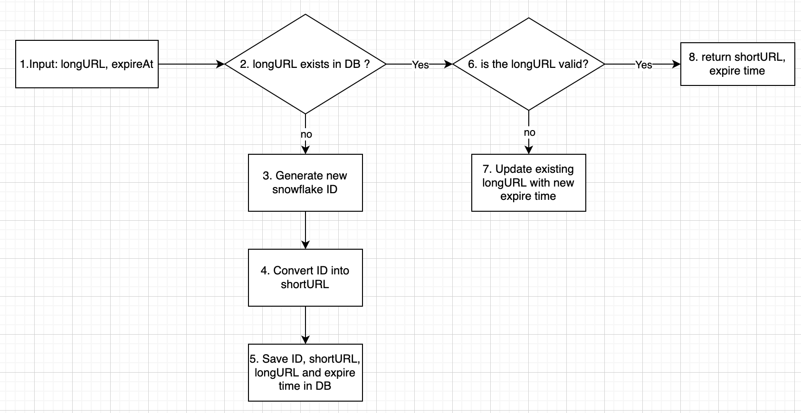

### Usage
```bash
./run.sh
```

### Data flow


### Limitation
1. For the time being, current implemention only support single instance. Running multiple instances will have chance to cause collision to occur. This is because node ID is hard coded to 1 now. To support reliability and high availability, this is not accepted, thus, node ID should be computed dynamically using IP address. This will be put inside todo list.
```go
node, err := snowflake.NewNode(1)  // 1 is hard coded value
```
2. [Twitter snowflake](https://github.com/bwmarrin/snowflake/blob/master/snowflake.go#L17) use  Nov 04 2010 01:42:54 UTC as base time and [41 bits](https://github.com/bwmarrin/snowflake/blob/master/snowflake.go#L117) to store a timestamp. This mean the time bits will eventually running out of space (roughly on Year 2079) and there will be probability of collision occuring. When that time comes, a new epoch time is needed. We can mitigate this problem by using later base time at the beginning to prolong the expiry date, but this is not the ultimate solution.

### Dependency
- [postgres](https://www.postgresql.org/docs/) : advanced RDBMS
- [redis](https://redis.io/documentation) : fast key value store
- [gin](https://github.com/gin-gonic/gin) : fast http framework
- [sqlx](https://github.com/jmoiron/sqlx) : user-friendly version of `database/sql`
- [go-redis](https://github.com/go-redis/redis) : redis driver
- [snowflake](https://github.com/bwmarrin/snowflake) : generate unique ID
- [base62](https://github.com/mattheath/base62) : base62 conversion utility
